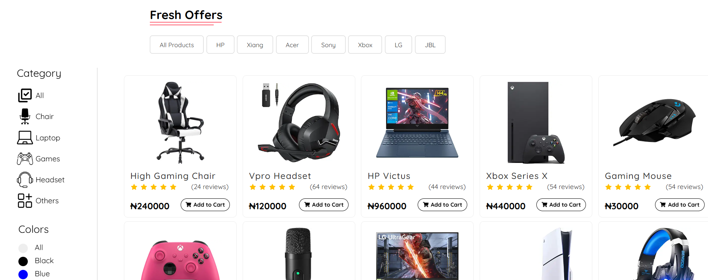
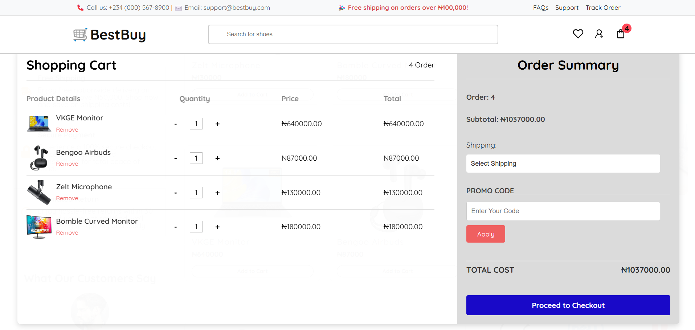

🛒 BestBuy E-Commerce React Website
An elegant and responsive e-commerce platform built with React, offering features like product filtering, a dynamic cart, and user-friendly navigation.

🌟 Features
Dynamic Cart: Add/remove items, real-time quantity updates.
Product Filtering: Filter by price and categories.
Search: Find products easily with a dynamic search bar.
Wishlist: Save items for later.
Responsive Design: Optimized for all devices.
Smooth Animations: Engaging transitions for a seamless experience.
🚀 Technologies Used
React (Frontend Framework)
React Router (Routing)
Context API (State Management)
CSS (Responsive Styling)
React Icons (Iconography)
Build Tool: Vite or Create React App

ChatGPT
Here’s a README.md file with everything concise and contained on a single page:

🛒 E-Commerce React Website
An elegant and responsive e-commerce platform built with React, offering features like product filtering, a dynamic cart, and user-friendly navigation.

🌟 Features
Dynamic Cart: Add/remove items, real-time quantity updates.
Product Filtering: Filter by price and categories.
Search: Find products easily with a dynamic search bar.
Wishlist: Save items for later.
Responsive Design: Optimized for all devices.
Smooth Animations: Engaging transitions for a seamless experience.
🚀 Technologies Used
React (Frontend Framework)
React Router (Routing)
Context API (State Management)
CSS (Responsive Styling)
React Icons (Iconography)
Build Tool: Vite or Create React App

1. 🖥️ Installation
Clone the repository:
git clone https://github.com/adeoluwaadeoye/BestBuy
cd BestBuy

2. Install Dependencies
npm install

3. Run the development server:
npm start

4. Open http://localhost:3000 in your browser.

 

 

📧 Contact
Name: Adeoluwa Adeoye
 
Email: adeoluadeoye7@gmail.com
 
GitHub: https://github.com/adeoluwaadeoye
